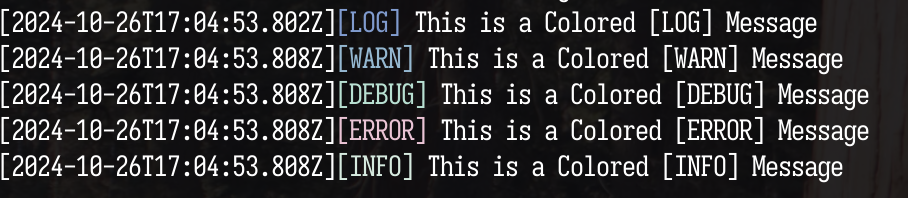

# @kourosh-alasti/logger

[](https://badge.fury.io/js/@kourosh-alasti/logger)

[Examples] (./examples/default.ts) &bullet;[Documentation] (https://github.com/kourosh-alasti/logalot/wiki) &bullet;[Changelog] (./CHANGELOG.md) &bullet;[License] (./LICENSE)

A TypeScript-first logging library

<div align="center">  </div>

## Table of Contents

- [@kourosh-alasti/logger] (#@kourosh-alasti/logger)
- [Table of Contents] (#table-of-contents)
- [Installation] (#installation)
- [Usage] (#usage)
- [Contributing] (#contributing)

## Installation

Add the package to your project via [npm](https://docs.npmjs.com/)

```bash
npm install @kourosh-alasti/logger
```

## Support Matrix

| Version | Supported |
| :-----: | :-------: |
| >=1.0.0 |    ✅    |

## Usage

There are two ways to add a logger to your application. The quickest way is using the default configuration.

```typescript
import { createLogger } from '@kourosh-alati/logger';

const logger = createLogger();

logger.log("Hello World!");
logger.warn("Hello World!");
logger.debug("Hello World!");
logger.error("Hello World!");
logger.info("Hello World!");
```

## Contributing

See [CONTRIBUTING.md] (./CONTRIBUTING.md)
